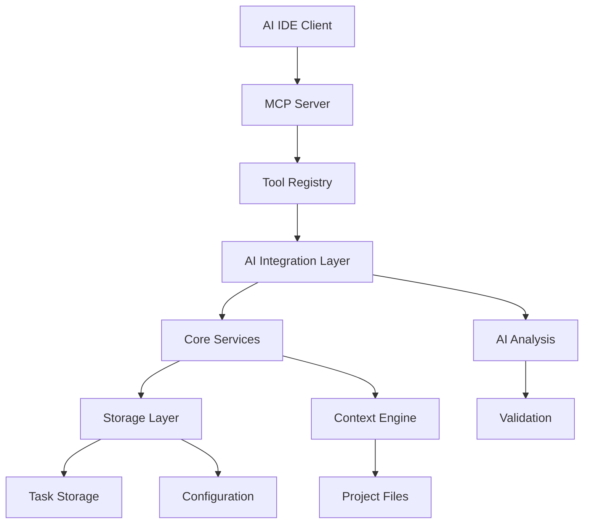

# SpecLinter Architecture

## System Architecture Overview

SpecLinter follows a sophisticated layered architecture designed for scalability, maintainability, and seamless AI integration. The system is built around the Model Context Protocol (MCP) specification, enabling native integration with AI development environments.

## Architectural Layers

### Layer 1: MCP Protocol Interface
**MCP Server Infrastructure** (98% confidence)
- Complete Model Context Protocol implementation
- Tool registration and request routing
- Error handling and response formatting
- Authentication and security
- Real-time communication with AI IDEs

### Layer 2: AI Integration Layer
**AI-First Tool Pattern** (94% confidence)
- Two-step analysis process (prepare → process)
- Structured prompt generation and engineering
- Validated AI response processing
- Schema-driven validation with Zod
- Comprehensive error recovery mechanisms

### Layer 3: Core Business Logic
**Feature Processing Layer** (92% confidence)
- Specification parsing and quality analysis
- Task generation and lifecycle management
- Feature discovery and reverse engineering
- Implementation validation and gap analysis
- Similarity detection and deduplication

### Layer 4: Storage & Context Management
**Data Persistence Layer** (89% confidence)
- File-based storage with SQLite fallback
- Project context generation and maintenance
- Configuration management with intelligent defaults
- State persistence and recovery
- Git integration for version control

## Key Architectural Patterns

### AI-First Tool Pattern (94% confidence)
```typescript
// Consistent two-step AI integration
const prepareResult = await collectData(inputs);
const aiAnalysis = await processWithAI(prepareResult.prompt);
const result = await processValidatedResponse(aiAnalysis);
```

### Schema-Driven Validation (96% confidence)
```typescript
// Comprehensive validation throughout
const inputSchema = z.object({
  project_root: z.string().optional(),
  analysis_depth: z.enum(['quick', 'standard', 'deep'])
});
```

### Unified Analysis Pipeline (90% confidence)
Consistent processing flow across all analysis types:
1. Input validation and sanitization
2. Context gathering and preparation
3. AI analysis with structured prompts
4. Result validation and error handling
5. Storage, documentation, and response

## Component Interactions



## Data Flow Architecture

### Specification Analysis Flow
1. **Input Reception**: MCP tool receives specification
2. **Context Gathering**: Project context and patterns analyzed
3. **AI Analysis**: Structured AI analysis with quality assessment
4. **Task Generation**: Breakdown into actionable development tasks
5. **Validation**: Quality gates and acceptance criteria validation
6. **Storage**: Persistent storage with Git integration
7. **Response**: Structured response with implementation guidance

### Reverse Specification Flow
1. **Codebase Scanning**: Intelligent file discovery and filtering
2. **Feature Detection**: AI-powered feature boundary detection
3. **Pattern Analysis**: Architectural and code pattern extraction
4. **Specification Generation**: Automated spec creation from code
5. **Context Integration**: Documentation and architecture updates
6. **Validation**: Confidence scoring and quality assessment

## Scalability Considerations

### Performance Optimization
- **Incremental Analysis**: Support for large codebase processing
- **Configurable Limits**: Adjustable file counts and sizes
- **Caching Strategy**: Context files reduce redundant analysis
- **Batch Processing**: Efficient handling of multiple specifications

### Extensibility Design
- **Modular Architecture**: Easy addition of new analysis types
- **Plugin System**: Extensible tool registration
- **Schema Evolution**: Backward-compatible schema updates
- **AI Model Agnostic**: Support for different AI providers

## Security and Reliability

### Security Model
- **Input Validation**: Comprehensive Zod schema validation
- **File System Safety**: Controlled access to project directories
- **Configuration Isolation**: Secure configuration management
- **Error Sanitization**: Safe error message handling
- **Access Control**: Project-scoped operations

### Reliability Features
- **Error Recovery**: Robust fallback mechanisms
- **State Consistency**: Transactional operations where possible
- **Validation Gates**: Multiple validation layers
- **Graceful Degradation**: Fallback to simpler analysis when needed
- **Monitoring**: Comprehensive logging and error tracking

## Technology Stack Integration

### Core Technologies
- **TypeScript**: Full type safety with runtime validation
- **Node.js**: High-performance JavaScript runtime
- **Zod**: Schema validation and type inference
- **SQLite**: Lightweight, reliable data persistence
- **Vitest**: Modern testing framework with TypeScript support

### AI Integration
- **Model Context Protocol**: Standard AI IDE integration
- **Structured Prompting**: Consistent AI interaction patterns
- **Response Validation**: Strict schema adherence
- **Error Recovery**: Intelligent fallback strategies

## Implementation Decisions

### Why MCP?
- Native AI IDE integration without custom protocols
- Standardized tool interface across different AI assistants
- Real-time communication capabilities
- Extensible tool registration system

### Why AI-First Architecture?
- Leverages AI capabilities for complex analysis tasks
- Reduces manual pattern detection and rule maintenance
- Enables sophisticated natural language processing
- Provides intelligent quality assessment and recommendations

### Why File-Based Storage?
- Git-friendly version control integration
- Human-readable project artifacts
- Easy backup and synchronization
- Transparent data management
- SQLite fallback for complex queries when needed