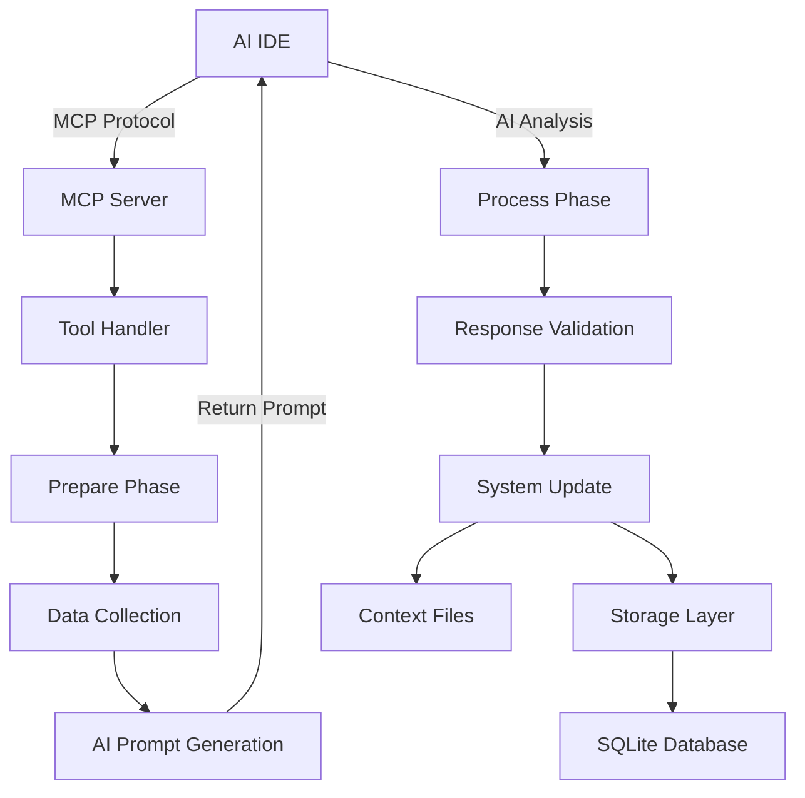

# Architecture

## System Design Philosophy
SpecLinter MCP follows a **modular, AI-first architecture** designed for extensibility and reliability. The system prioritizes semantic understanding over pattern matching, using AI as a core component rather than an add-on.

## Core Architecture Components

### 1. MCP Server Layer
**Purpose**: Model Context Protocol interface for AI IDE integration
**Location**: `src/server.ts`

- **Tool Registration**: Exposes SpecLinter capabilities as MCP tools
- **Schema Validation**: Zod-based input validation for all tools
- **Error Handling**: Consistent error responses across all tools
- **Transport**: stdio-based communication with AI IDEs

### 2. AI Integration Layer
**Purpose**: Two-step AI analysis pattern for reliable AI-powered operations
**Location**: `src/ai-tools.ts`

**Design Pattern**: Prepare → AI Analysis → Process
1. **Prepare Phase**: Collect project data, generate comprehensive prompts
2. **AI Analysis**: External AI performs semantic analysis
3. **Process Phase**: Validate AI responses, update system state

**Benefits**:
- Separates data collection from AI analysis
- Enables validation of AI responses
- Supports different AI providers
- Maintains system reliability

### 3. Core Business Logic
**Purpose**: Domain-specific functionality independent of AI or MCP
**Location**: `src/core/`

- **Storage Management**: SQLite-based persistence with initialization
- **Task Generation**: Structured task creation and management
- **Codebase Analysis**: Project structure and pattern detection
- **Configuration**: Flexible, hierarchical configuration system

### 4. Type System
**Purpose**: Comprehensive type safety with runtime validation
**Location**: `src/types/`

- **Compile-time Safety**: TypeScript interfaces and types
- **Runtime Validation**: Zod schemas for external data
- **Schema Documentation**: Self-documenting API contracts

## Data Flow Architecture

## Key Architectural Decisions

### Decision: Two-Step AI Integration
**Context**: Need reliable AI-powered analysis with validation
**Rationale**: 
- Separates concerns between data preparation and AI analysis
- Enables validation and error handling of AI responses
- Supports different AI providers and models
- Maintains system state consistency

**Trade-offs**:
- ✅ Increased reliability and validation
- ✅ Better error handling and debugging
- ❌ Slightly more complex implementation
- ❌ Requires two tool calls per AI operation

**Alternatives Considered**: Direct AI integration, webhook-based analysis

### Decision: MCP Protocol for AI IDE Integration
**Context**: Need standardized way to integrate with AI development environments
**Rationale**:
- Emerging standard for AI tool integration
- Supported by major AI IDEs (Claude, Cursor)
- Provides structured tool interface
- Enables rich context sharing

**Trade-offs**:
- ✅ Standardized integration approach
- ✅ Rich context and tool capabilities
- ✅ Growing ecosystem support
- ❌ Relatively new protocol
- ❌ Limited to stdio transport currently

**Alternatives Considered**: REST API, GraphQL, CLI-only interface

### Decision: SQLite for Task Persistence
**Context**: Need lightweight, reliable storage for task management
**Rationale**:
- Zero-configuration database
- ACID compliance for data integrity
- Excellent TypeScript/Node.js support
- Suitable for single-project scope

**Trade-offs**:
- ✅ Simple deployment and backup
- ✅ Strong consistency guarantees
- ✅ No external dependencies
- ❌ Limited to single-process access
- ❌ Not suitable for distributed scenarios

**Alternatives Considered**: JSON files, PostgreSQL, MongoDB

### Decision: TypeScript with Zod Validation
**Context**: Need type safety for complex AI data structures
**Rationale**:
- Compile-time type checking
- Runtime validation for external data
- Self-documenting schemas
- Excellent IDE support

**Trade-offs**:
- ✅ Comprehensive type safety
- ✅ Runtime validation of AI responses
- ✅ Excellent developer experience
- ❌ Additional build complexity
- ❌ Learning curve for Zod schemas

**Alternatives Considered**: JavaScript with PropTypes, Flow, pure TypeScript

## Scalability Considerations

### Current Limitations
- **Single Project Scope**: Designed for individual project analysis
- **SQLite Concurrency**: Limited to single-process access
- **Memory Usage**: Loads entire codebase for analysis

### Scaling Strategies
- **Incremental Analysis**: Process only changed files
- **Caching Layer**: Cache analysis results for repeated operations
- **Distributed Storage**: PostgreSQL for multi-project scenarios
- **Streaming Analysis**: Process large codebases in chunks

## Security Architecture

### Data Protection
- **Local Storage**: All data remains on user's machine
- **No External APIs**: AI analysis performed by user's chosen AI
- **File System Isolation**: Respects project boundaries

### Input Validation
- **Schema Validation**: All inputs validated against Zod schemas
- **Path Sanitization**: Prevents directory traversal attacks
- **Resource Limits**: Configurable limits on file size and count

## Extension Points

### Adding New AI Tools
1. Create prepare function in `src/ai-tools.ts`
2. Create process function with schema validation
3. Register tools in `src/ai-server-tools.ts`
4. Add schema documentation

### Custom Analysis Types
1. Define new analysis schema in `src/types/`
2. Implement analysis logic in `src/core/`
3. Create AI prompts for new analysis type
4. Add validation and processing logic

### Storage Extensions
1. Extend `StorageManager` interface
2. Implement new storage backend
3. Update configuration schema
4. Maintain backward compatibility

This architecture provides a solid foundation for AI-powered development tools while maintaining flexibility for future enhancements and integrations.